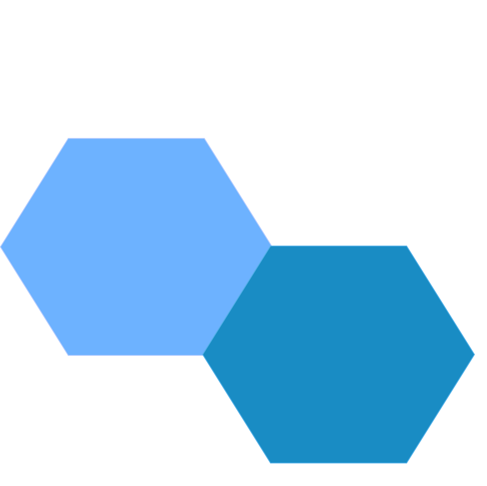

<div align="center">
  
  <h1 style="font-size: 2.5em; margin: 0.5em 0 0.3em; font-weight: 700; letter-spacing: -0.02em;">WORK<b>DEEP</b>SPACE</h1>
</div>

**WorkDeepSpace** is a modular, browser-based productivity command deck designed for deep work and high-performance engineering. It allows developers to build a personalized workspace by assembling functional "blocks" (modules) onto a synchronized grid, simulating a mission control center for software development.

## AI-Augmented Engineering

This project is built with a "Machine-Partner" philosophy. **WorkDeepSpace** is designed to be developed and extended using AI:
* **Co-Created with AI**: The core architecture and modules are the result of a collaborative process between human intuition and Artificial Intelligence.
* **AI-Ready Modules**: The codebase is structured to be easily understood and extended by Large Language Models (LLMs).
* **Instruction-Based Scaling**: The included `quickstart.md` provides a concise, standardized set of instructions that allow any AI model to generate fully compatible modules from scratch.

## The Concept: "Mission-Ready Modularity"

The application functions as a high-performance "base-plate." Users don't just use an app; they **assemble** their mission control.
* **Live Coding Optimized**: Designed for real-time iteration. The modular structure allows for hot-swapping logic and UI during live development sessions.
* **Custom Blocks**: Droppable React components that act as independent tools.
* **Flexible Layout**: A split-panel dashboard with resizable containers and floating overlay widgets.

## Tech Stack

- **Frontend**: React 18 + TypeScript + Vite.
- **Styling**: Zero-library approach. All UI uses a custom Token System (`ms`) and CSS variables for instant theme switching.
- **State Management**: Custom singleton stores using `useSyncExternalStore` for reactive UI updates.
- **Database**: PostgreSQL everywhere. Runtime selection between PGlite (WASM) for local development and real PostgreSQL for production.
- **Backend** (production): Express.js server with PostgreSQL driver for remote data persistence.
- **Persistence Layer**: Built with a "Bring Your Own Database" philosophy. Users provide their own PostgreSQL instance (Neon, AWS RDS, DigitalOcean, Supabase, etc.), and the system handles all data persistence securely.

## Core Modules & Widgets

| Feature | Type | Description |
|:--- |:--- |:--- |
| **Kanban** | Module | Three-column task management with drag-and-drop workflow. |
| **Sprint Board** | Module | Agile backlog management with Fibonacci points and burn-down indicators. |
| **Roadmap** | Module | Gantt-style timeline with draggable and resizable epic bars. |
| **Chat** | Widget | Integrated team communication with unread notifications. |
| **Notes** | Widget | Markdown-ready private editor with color-coded labeling. |

## Data Sovereignty

**WorkDeepSpace** is the only productivity suite that empowers you to own your data completely.

### Local Development (PGlite)

1. **Zero setup**: `npm run dev:local` starts immediately
2. **WASM PostgreSQL** runs in-process (no external dependency)
3. **IndexedDB storage** persists between sessions automatically
4. **Perfect for**: Building, prototyping, and offline work

### Production (Your PostgreSQL)

Unlike SaaS products that host your data:

- **You own the database instance** — deploy on any PostgreSQL provider
- **Your private server** — the Express backend runs on your infrastructure
- **Full encryption/security** — control TLS, backups, and access logs
- **Zero vendor lock-in** — switch providers anytime without data loss

#### PostgreSQL Options

- **[Neon](https://neon.tech)** — Serverless PostgreSQL
- **[AWS RDS](https://aws.amazon.com/rds/postgresql/)** — Managed PostgreSQL on AWS
- **[DigitalOcean](https://www.digitalocean.com/products/managed-databases)** — Simple managed databases
- **[Supabase](https://supabase.com)** — PostgreSQL with additional APIs
- **[Railway](https://railway.app)** — Fast deployment platform
- **Self-hosted** — VPS or on-premises server

### How It Works

**Development:**
```
┌─────────────┐
│  Vite App   │
│   (React)   │
└──────┬──────┘
       │
       └──→ PGlite (WASM)
             │
             └──→ IndexedDB
                  (persists)
```

**Production:**
```
┌─────────────┐
│  Vite App   │  (built frontend)
│   (React)   │
└──────┬──────┘
       │ fetch()
       ↓
┌─────────────────────┐
│  Express Backend    │
│  (Node.js server)   │
└──────┬──────────────┘
       │ pg driver
       ↓
┌─────────────────────┐
│  PostgreSQL         │
│  (your choice)      │
│  Neon / RDS / etc   │
└─────────────────────┘
```

### Setup

Detailed setup instructions are in [QUICKSTART.md](QUICKSTART.md).

```bash
# Local development (fastest)
npm run dev:local

# Remote development (real PostgreSQL)
npm run dev:remote        # Requires .env.local

# Production build
npm run build
```

## Getting Started

```bash
# Clone the repository
git clone https://github.com/your-repo/workdeepspace.git
cd workdeepspace

# Install dependencies
npm install

# Option 1: Local development (PGlite — fastest)
npm run dev:local
# Opens http://localhost:5173 with in-memory PostgreSQL

# Option 2: Remote development (Real PostgreSQL)
# 1. Set up a PostgreSQL database (e.g., Neon free tier)
# 2. Copy .env.example to .env.local
# 3. Fill in your database credentials
# 4. Run:
npm run dev:remote
# Opens http://localhost:5173 + Express backend on :3001
```

**Login credentials (dev):**
- Username: `dev`
- Password: `dev`

See [QUICKSTART.md](QUICKSTART.md) for detailed setup instructions, module development guide, and database schema patterns.
